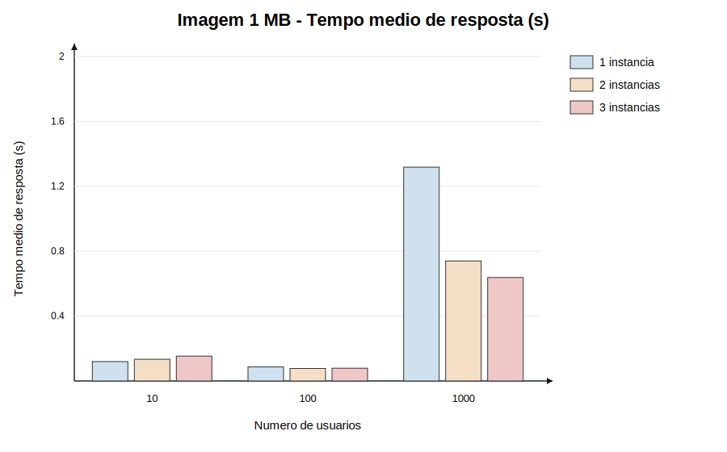
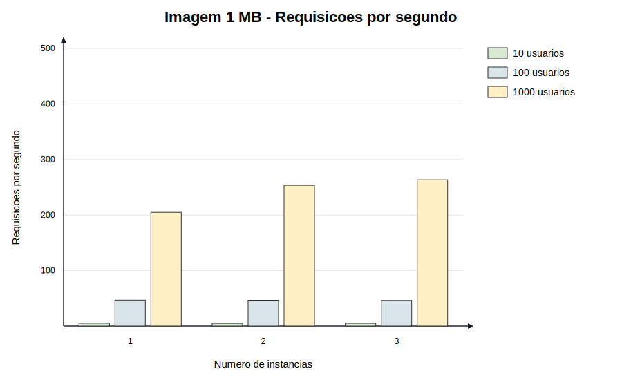
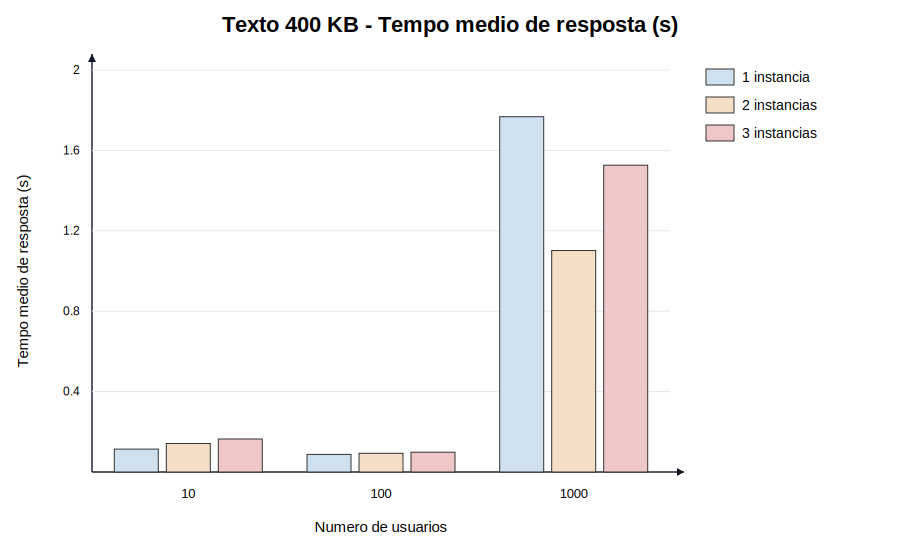
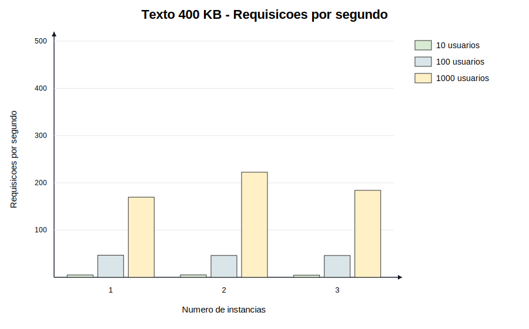
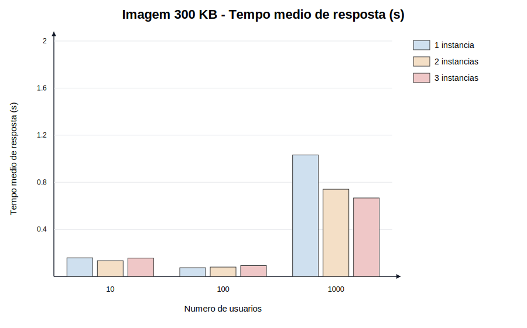
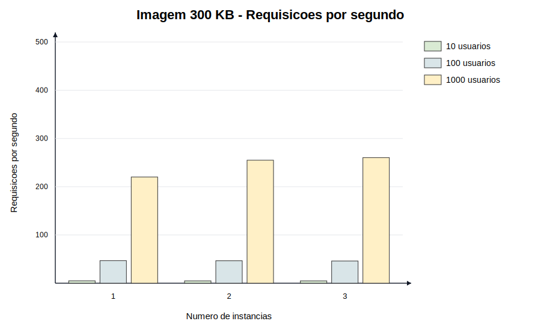
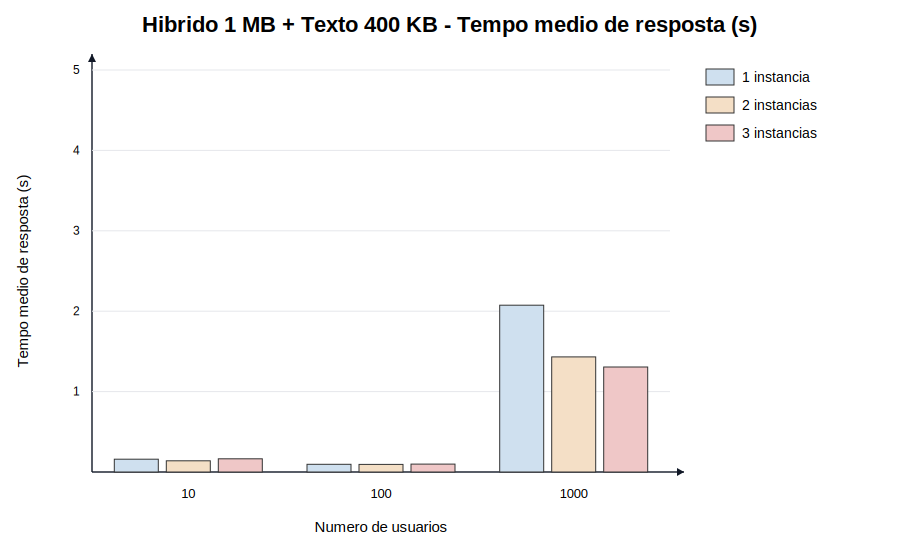
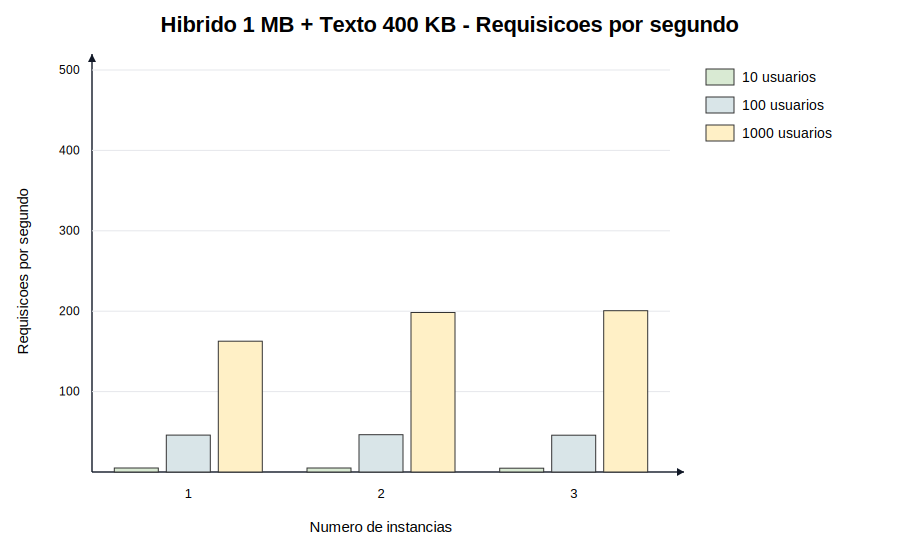

# Arquitetura de Alta Disponibilidade com WordPress e Nginx

Este projeto implementa uma infraestrutura com Docker composta por MySQL, tres instancias WordPress e um balanceador de carga Nginx. O objetivo e distribuir as requisicoes entre as instancias da aplicacao usando Round Robin.

## Estrutura

- `mysql-db`: banco de dados MySQL com armazenamento persistente em `mysql_data/`.
- `wordpress1`, `wordpress2`, `wordpress3`: instancias da aplicacao WordPress.
- `nginx`: balanceador de carga na porta `80`.
- `wordpress-net`: rede Docker bridge usada na comunicacao entre os containers.
- `locust`: gerador de carga usado nos testes do Trabalho 3.

## Pre-requisitos

- Docker
- Docker Compose

## Executar com Docker Compose

Na pasta do projeto, execute:

```bash
docker-compose up -d
```

Depois acesse:

```text
http://localhost
```

Para verificar os containers:

```bash
docker ps
```

Para testar via terminal:

```bash
curl -I http://localhost
```

## Executar Manualmente sem Docker Compose

Crie a rede:

```bash
docker network create wordpress-net
```

Crie o MySQL:

```bash
docker run -d --name mysql-db --network wordpress-net ^
  -e MYSQL_ROOT_PASSWORD=r00t ^
  -e MYSQL_DATABASE=wordpress ^
  -e MYSQL_USER=usr-wordpress ^
  -e MYSQL_PASSWORD=pwd-wordpress ^
  -v %cd%/mysql_data:/var/lib/mysql ^
  mysql:5.7
```

Crie as tres instancias WordPress:

```bash
docker run -d --name wordpress1 --network wordpress-net ^
  -v %cd%/html:/var/www/html ^
  -e WORDPRESS_DB_HOST=mysql-db ^
  -e WORDPRESS_DB_USER=usr-wordpress ^
  -e WORDPRESS_DB_PASSWORD=pwd-wordpress ^
  -e WORDPRESS_DB_NAME=wordpress ^
  wordpress:5.4.2-php7.2-apache

docker run -d --name wordpress2 --network wordpress-net ^
  -v %cd%/html:/var/www/html ^
  -e WORDPRESS_DB_HOST=mysql-db ^
  -e WORDPRESS_DB_USER=usr-wordpress ^
  -e WORDPRESS_DB_PASSWORD=pwd-wordpress ^
  -e WORDPRESS_DB_NAME=wordpress ^
  wordpress:5.4.2-php7.2-apache

docker run -d --name wordpress3 --network wordpress-net ^
  -v %cd%/html:/var/www/html ^
  -e WORDPRESS_DB_HOST=mysql-db ^
  -e WORDPRESS_DB_USER=usr-wordpress ^
  -e WORDPRESS_DB_PASSWORD=pwd-wordpress ^
  -e WORDPRESS_DB_NAME=wordpress ^
  wordpress:5.4.2-php7.2-apache
```

Crie o Nginx:

```bash
docker run -d --name nginx -p 80:80 --network wordpress-net ^
  -v %cd%/nginx.conf:/etc/nginx/nginx.conf:ro ^
  -v %cd%/html:/usr/share/nginx/html ^
  nginx:1.19.0
```

Para remover a infraestrutura manual:

```bash
docker stop mysql-db wordpress1 wordpress2 wordpress3 nginx
docker rm mysql-db wordpress1 wordpress2 wordpress3 nginx
docker network rm wordpress-net
```

## Trabalho 3 - Testes de Carga com Locust

O Locust foi adicionado ao `docker-compose.yaml` para executar testes de carga contra o Nginx, que distribui as requisicoes entre as instancias WordPress.

### Cenarios

Foram testados quatro posts:

- `/?p=5`: post com imagem de aproximadamente 1 MB.
- `/?p=10`: post com texto de aproximadamente 400 KB.
- `/?p=13`: post com imagem de aproximadamente 300 KB.
- `/?p=17`: post hibrido com imagem de aproximadamente 1 MB e texto de aproximadamente 400 KB.

Cada cenario foi executado variando:

- usuarios simultaneos: `10`, `100`, `1000`;
- instancias WordPress: `1`, `2`, `3`;
- duracao por teste: `30s`.

Total:

```text
4 cenarios x 3 quantidades de usuarios x 3 quantidades de instancias = 36 testes
```

### Arquivos Importantes

- `locust/locustfile.py`: script de comportamento dos usuarios.
- `scripts/run-load-tests.ps1`: executa todos os testes.
- `scripts/generate-bar-graphs.py`: gera graficos de barras no estilo solicitado.
- `reports/summary.csv`: resumo das metricas coletadas.
- `reports/bar_graphs/`: graficos finais em SVG.
- `nginx-1.conf`, `nginx-2.conf`, `nginx.conf`: configuracoes para 1, 2 e 3 instancias.

### Rodar Todos os Testes

```powershell
.\scripts\run-load-tests.ps1 -Duration "30s"
```

Para rodar apenas alguns cenarios, informe as chaves desejadas:

```powershell
.\scripts\run-load-tests.ps1 -Duration "30s" -Scenarios imagem_1mb,hibrido_1mb_texto_400kb
```

### Gerar os Graficos Novamente

```powershell
python scripts/generate-bar-graphs.py
```

## Resultados

As metricas analisadas foram:

- tempo medio de resposta;
- requisicoes por segundo;
- quantidade de falhas;
- percentil 95;
- percentil 99.

### Imagem 1 MB - Tempo Medio por Usuarios



### Imagem 1 MB - Requisicoes por Segundo por Instancias



### Texto 400 KB - Tempo Medio por Usuarios



### Texto 400 KB - Requisicoes por Segundo por Instancias



### Imagem 300 KB - Tempo Medio por Usuarios



### Imagem 300 KB - Requisicoes por Segundo por Instancias



### Hibrido 1 MB + Texto 400 KB - Tempo Medio por Usuarios



### Hibrido 1 MB + Texto 400 KB - Requisicoes por Segundo por Instancias



## Observacao

Nos testes com `1000` usuarios simultaneos ocorreram falhas HTTP 500 em alguns cenarios. No teste hibrido com 3 instancias e 1000 usuarios, o Locust tambem registrou aviso de CPU acima de 90%, o que pode afetar a consistencia das medicoes nessa carga. Esse comportamento indica degradacao da aplicacao sob carga alta e pode ser usado na analise dos resultados.
